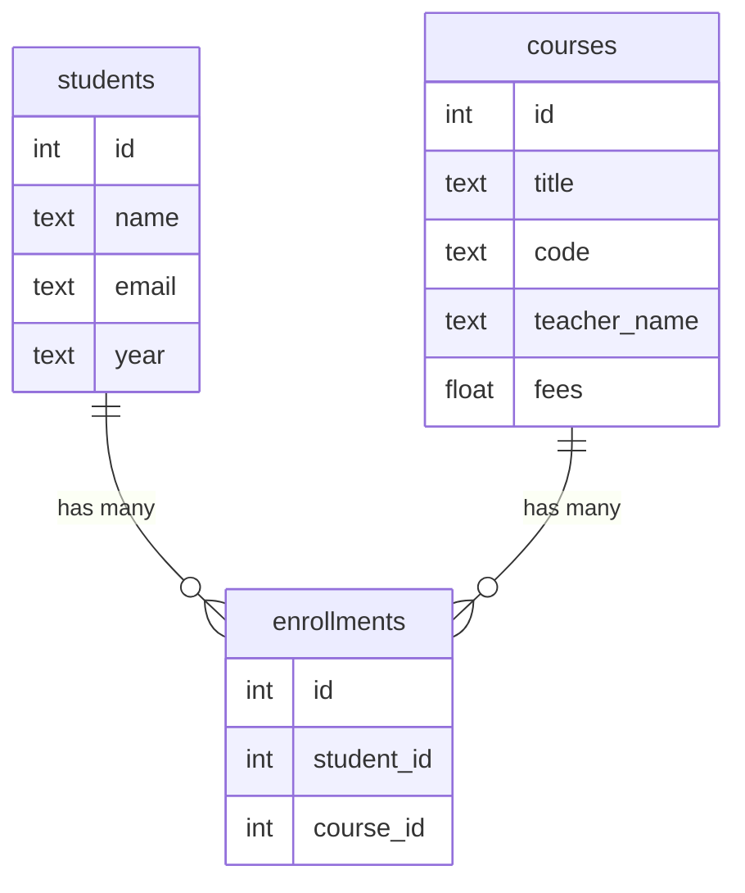

# JOINs

## The problem a JOIN solves

Open the **Enrollments** page in the project. Here is what the database actually stores:

| id | student_id | course_id | enrolled_on |
|---|---|---|---|
| 22 | 12 | 3 | 2026-09-05 |
| 23 | 12 | 4 | 2026-09-05 |
| 24 | 10 | 6 | 2026-09-05 |

Useless to a human. Who is student 12? What is course 3?

Now open **Enrollments → See the joined report**:

| Student | Course | Teacher | Fees |
|---|---|---|---|
| Nisha Gupta | Full Stack Web Development | Mr. Kunal Mehta | 5,999 |
| Nisha Gupta | Database Systems | Dr. Meera Krishnan | 4,499 |
| Sanya Kapoor | Computer Networks | Dr. Aditi Menon | 3,799 |

**Same rows.** One SQL query turned the numbers into names.

---

## Why the numbers are there in the first place

You might ask: why not just store the student's name in the enrollments table and skip all
this?

<div class="compare">
<div>

**Storing the name (bad)**

```
enrollments
-----------
id | student_name | course_title
22 | Nisha Gupta  | Full Stack...
23 | Nisha Gupta  | Database Sys...
```

</div>
<div>

**Storing the id (good)**

```
enrollments
-----------
id | student_id | course_id
22 | 12         | 3
23 | 12         | 4
```

</div>
</div>

Now Nisha changes her email, or you spot a typo in her name.

- **Left**: you must find and fix every row that repeats her name. Miss one and your data
  now disagrees with itself.
- **Right**: you change one row in `students`. Every enrollment still points at id 12 and
  is instantly correct.

That is the whole reason relational databases exist. Store each fact **once**, and point at
it. The pointer is called a **foreign key**.

---

## The three tables in this project



`enrollments` exists only to connect the other two. A table like that has names you will
hear: **join table**, **junction table**, **link table**. They all mean this.

It is what lets one student take many courses **and** one course hold many students. That
is a **many-to-many** relationship, and you cannot express it with two tables alone.

---

## The actual query

This is `backend/database/reports.py`, unedited:

```sql
SELECT
    e.id           AS enrollment_id,
    e.enrolled_on,

    s.id           AS student_id,
    s.name         AS student_name,
    s.email        AS student_email,

    c.id           AS course_id,
    c.title        AS course_title,
    c.teacher_name AS teacher_name,
    c.fees         AS fees

FROM enrollments e                          -- (1)!
JOIN students s ON s.id = e.student_id      -- (2)!
JOIN courses  c ON c.id = e.course_id       -- (3)!
ORDER BY e.id DESC
```

1. Start from the join table. `e` is a short nickname for `enrollments`
2. For each enrollment, find the student whose `id` matches its `student_id`
3. And the course whose `id` matches its `course_id`

Read line 2 out loud as a sentence: *"attach the students row where the student's id equals
this enrollment's student_id."* That is genuinely all `JOIN ... ON` means.

---

## What the database does with it

Walk one row:

<ol class="steps">
  <li>Take enrollment 22. It holds <code>student_id = 12</code> and <code>course_id = 3</code>.</li>
  <li>Go to <code>students</code>, find id 12. That is Nisha Gupta.</li>
  <li>Go to <code>courses</code>, find id 3. That is Full Stack Web Development.</li>
  <li>Glue all three rows side by side into one wide row.</li>
  <li>Repeat for every enrollment.</li>
</ol>

The result is one row per enrollment, carrying columns from all three tables.

!!! tip "Why one query and not three"
    We could have fetched enrollments, then students, then courses, and matched them in
    Python. In fact the frontend does something like that on the Enrollments page.

    But that is **three trips** to a database in another country, and this project measures
    about 2.5 seconds per trip. The JOIN is **one** trip, and the database is far better at
    matching rows than our Python loop is.

    Compare `database/reports.py` with `hooks/useEnrollments.js` in the frontend. Same
    information, two very different approaches, and both are in this project on purpose.

---

## The kinds of JOIN

You will meet four. Only the first two matter for now.

| Type | Keeps | Use it when |
|---|---|---|
| `JOIN` (inner) | only rows that match on **both** sides | **the default.** You want complete pairs |
| `LEFT JOIN` | every row on the left, even with no match | "list all students, and their courses if any" |
| `RIGHT JOIN` | the mirror image | rare, just swap the tables instead |
| `FULL JOIN` | everything from both sides | rarer still |

Our report uses an inner `JOIN`, and that choice has a consequence worth noticing:

!!! question "A question for class"
    Our report uses inner `JOIN`. A student who is enrolled in **nothing** has no rows in
    `enrollments`.

    **Does that student appear in the report?**

    No. They vanish entirely. If you wanted "every student, with a blank row when they have
    no courses", you would need `LEFT JOIN` starting from `students`.

    Try it: edit the query, reload the Report page, see what changes.

---

## Try it yourself

The best way to learn JOINs is to run them, not read them.

- [pgexercises: JOINs](https://www.pgexercises.com/questions/joins/) is real Postgres in
  the browser, with answers. Do these.
- [SQLBolt lessons 6 to 9](https://sqlbolt.com/) cover joins interactively.

Then come back and change the query in `database/reports.py`. The Report page will show
your change on the next reload, and that feedback loop is the fastest way to make this
stick.

---

## Going further

- [Tables, keys and relationships](tables-and-keys.md), for primary and foreign keys
- [SQL injection](sql-injection.md), for why we never build these strings with f-strings
- `backend/database/reports.py`, the query above
- `frontend/src/components/reports/ReportTable.jsx`, which draws the result
