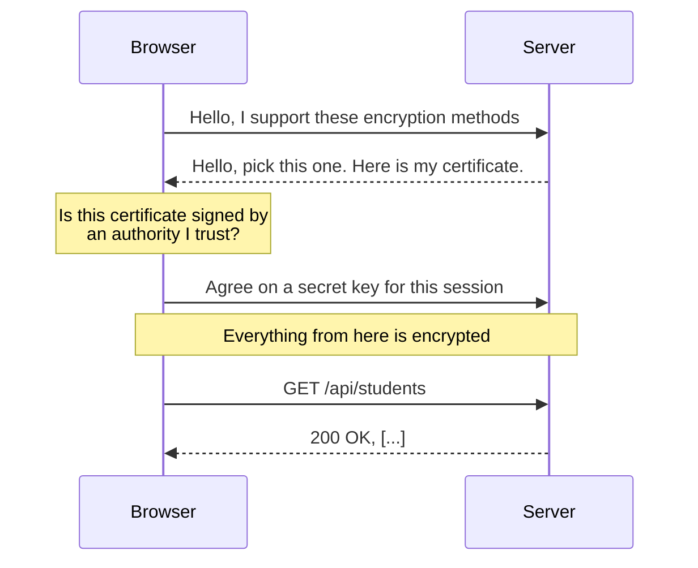

# HTTP vs HTTPS

## The one-sentence version

**HTTPS is HTTP with the conversation encrypted, so nobody in between can read it or change
it.** The rules of the conversation are identical. Only the wrapper differs.

---

## HTTP first: it is just text

HTTP is a text format. That is the whole trick, and it is why you can learn it by reading it.

When your React app asks for the student list, this is what actually crosses the network:

```http
GET /api/students HTTP/1.1
Host: localhost:8000
Accept: application/json
```

And the answer:

```http
HTTP/1.1 200 OK
Content-Type: application/json
Content-Length: 1847

[{"id":12,"name":"Nisha Gupta","email":"nisha.gupta@example.com"}]
```

That is it. A method, a path, some headers, a blank line, then a body. **You could type it
by hand**, and you will, using `curl`.

!!! tip "You have already seen this by hand"
    Before this project used FastAPI, it read those headers itself:

    ```python
    length = int(handler.headers.get("Content-Length", 0))
    raw = handler.rfile.read(length)
    ```

    That is a program reading the `Content-Length` header above, then reading exactly that
    many bytes of body. FastAPI does it for us now, but it is the same text.

---

## The problem with plain HTTP

The text above travels through equipment you do not own: your wifi router, your ISP, a few
internet exchanges, the hosting provider's network.

**Every one of them can read it.** And change it.

<ol class="steps">
  <li>You submit a login form over <code>http://</code>.</li>
  <li>Your password is in the request body, as plain text.</li>
  <li>Anyone on the same wifi can capture it with free software.</li>
  <li>They now have your password. You noticed nothing.</li>
</ol>

This is not theoretical. It is why browsers now mark `http://` pages as **Not Secure**.

---

## What HTTPS adds

Three guarantees, and it is worth naming all three because people usually only know the
first:

<div class="layers">
  <div class="layer">
    <code>Encryption</code>
    <span>anyone watching sees scrambled bytes, not your password</span>
  </div>
  <div class="layer">
    <code>Integrity</code>
    <span>if someone alters the data in transit, it is detected and rejected</span>
  </div>
  <div class="layer">
    <code>Authentication</code>
    <span>you are really talking to bank.com, not someone pretending to be it</span>
  </div>
</div>

That third one is the one students miss. Encryption alone would be useless if you could not
be sure **who** you had the encrypted conversation with.

---

## How it works, at the level you need



The key points:

- **The certificate** is the server proving its identity. It is signed by a Certificate
  Authority your browser already trusts.
- **The negotiation happens once** per connection, then all traffic reuses the agreed key.
- **The HTTP inside is unchanged.** Same methods, same headers, same status codes.

That last point matters: **you do not write different code for HTTPS.** Your FastAPI routes
are identical either way.

---

## So why is this project on `http://`?

Because it is running on your own laptop, and on `localhost` the traffic never touches a
network.

```
http://localhost:5173     the React app
http://localhost:8000     the API
```

There is no wifi router in between. There is no ISP. The data goes from a program on your
machine to another program on your machine. Nobody can intercept it, so there is nothing to
encrypt.

!!! note "Browsers treat localhost as trusted"
    You will notice Chrome does not put a "Not Secure" warning on `http://localhost`.
    That is a deliberate exception, precisely because there is no network to attack.

---

## Where HTTPS shows up in this project

Two places, both worth pointing at:

**1. The database connection.** Look at `backend/.env`:

```
DATABASE_URL=postgresql://...neon.tech/verceldb?sslmode=require
```

`sslmode=require` is the same idea as HTTPS, applied to Postgres. Our database is in
**us-east-1**, so that traffic crosses the real internet and absolutely must be encrypted.

**2. When you deploy.** Render and Vercel both give you `https://` automatically, with the
certificate handled for you. You will not configure it. In 2010 you would have paid for a
certificate and installed it by hand; now it is free and automatic, thanks to Let's Encrypt.

---

## The bit that ties into CORS

Remember that an [origin](../web/cors.md) is scheme plus host plus port.

**`http://site.com` and `https://site.com` are different origins.** Same host, same port,
different scheme. So switching a deployed app from HTTP to HTTPS can cause CORS errors that
were not there before, which is a genuinely confusing afternoon if you do not know why.

---

## Try it

See the difference for yourself:

```bash
# plain HTTP, and you can read every byte
curl -v http://localhost:8000/api/students

# HTTPS, and you can watch the certificate exchange
curl -v https://neon.tech
```

In the second, look for `TLS handshake`, `subject:` and `issuer:` in the output. That is the
certificate step from the diagram above, happening in front of you.

---

## Going further

- [How the internet works](how-the-internet-works.md), for what is between you and the server
- [DNS and domains](dns-and-domains.md), because a certificate is issued for a **name**
- [What is CORS](../web/cors.md), since the scheme is part of an origin
- [Cloudflare: what is HTTPS](https://www.cloudflare.com/en-gb/learning/ssl/what-is-https/)
