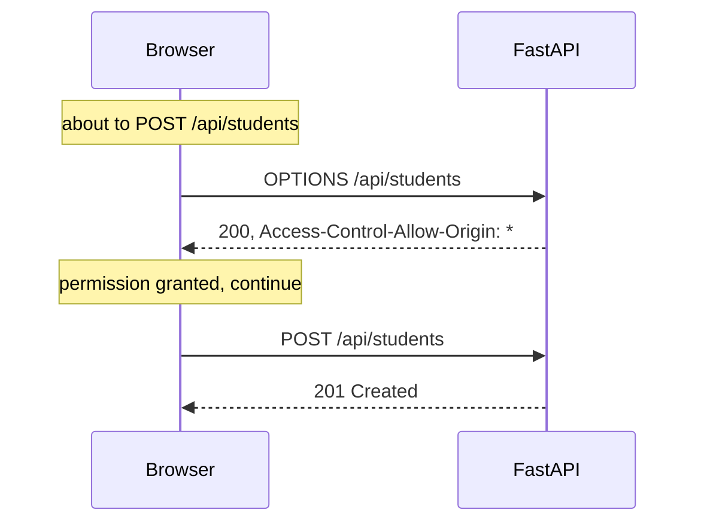

# What is CORS

## The one-sentence version

**A web page is not allowed to read data from a different address than the one it came
from, unless that other address gives permission.**

That rule is called CORS: Cross-Origin Resource Sharing. It is enforced by your
**browser**, not by the server.

---

## Why the rule exists at all

Imagine the rule did not exist.

<ol class="steps">
  <li>You log into your bank at <code>mybank.com</code>. The bank puts a cookie in your browser.</li>
  <li>In another tab, you open <code>free-movies.example</code>.</li>
  <li>That page runs JavaScript: <code>fetch("https://mybank.com/api/balance")</code>.</li>
  <li>Your browser attaches your bank cookie, because the request is going to the bank.</li>
  <li>The bank sees a logged-in user and returns your balance.</li>
  <li>The movie site now has your bank balance, and you never clicked anything.</li>
</ol>

Step 6 is what CORS prevents. The request may still be sent, but **the browser refuses to
let the calling page read the answer.**

!!! warning "CORS is a browser rule, not a security wall"
    `curl` has no CORS. Python has no CORS. Postman has no CORS.

    ```bash
    # No CORS involved, this just works
    curl http://localhost:8000/api/students
    ```

    CORS protects **users of browsers** from pages they did not trust. It does not protect
    your server from anyone. Your server is protected by checking every request itself,
    which is what `api/` does in this project.

---

## What "origin" means, precisely

An origin is three things joined together:

```
      scheme        host          port
      http://    localhost    :   5173
```

**Change any one of the three and it is a different origin.** This surprises people:

| Comparison | Same origin? |
|---|---|
| `http://localhost:5173` and `http://localhost:8000` | **No.** Different port |
| `http://localhost:5173` and `https://localhost:5173` | **No.** Different scheme |
| `http://site.com` and `http://api.site.com` | **No.** Different host |
| `http://localhost:5173/students` and `http://localhost:5173/courses` | **Yes.** Path does not count |

That third row is why real apps hit this constantly, and the first row is why **you** hit
it in this project.

---

## Where this bites us, exactly

In development we run two servers:

<div class="flow">
  <div class="flow-box"><strong>React</strong><small>localhost:5173</small></div>
  <div class="flow-wire"></div>
  <div class="flow-box"><strong>FastAPI</strong><small>localhost:8000</small></div>
</div>

Different ports means **different origins**. So a `fetch` from the React page to the API
is a cross-origin request, and the browser applies the rule.

---

## The two ways we deal with it

This project uses **both**, for different situations. That is worth understanding, because
students often assume only one exists.

### 1. In development: the Vite proxy

Look at `frontend/vite.config.js`:

```js
server: {
  port: 5173,
  proxy: {
    "/api": {                              // (1)!
      target: "http://localhost:8000",     // (2)!
    },
  },
}
```

1. Any request whose path starts with `/api`
2. is quietly forwarded to the backend by Vite itself

So when React calls `fetch("/api/students")`, the browser thinks it is talking to
`localhost:5173`, which is **where the page came from**. Same origin. No CORS involved at
all.

Vite then makes the real call to port 8000 from Node, where CORS does not apply.

!!! tip "This is the neatest fix"
    The proxy makes the problem disappear rather than negotiating around it. That is why
    the frontend code says `/api/students` and never `http://localhost:8000/api/students`.

### 2. In production, and as a backstop: the server gives permission

The server can say "I allow this". In `backend/main.py`:

```python
app.add_middleware(
    CORSMiddleware,
    allow_origins=["*"],     # (1)!
    allow_methods=["*"],
    allow_headers=["*"],
)
```

1. `"*"` means **any website may call this API**

That middleware adds a header to every response:

```
Access-Control-Allow-Origin: *
```

The browser reads that header and decides the page is allowed to see the answer.

!!! danger "`*` is fine for a class project and wrong for a real one"
    `allow_origins=["*"]` means literally any site on the internet can call your API from
    a user's browser. For this course that is convenient and harmless.

    In a real application you list your own site:

    ```python
    allow_origins=["https://myapp.com"]
    ```

    If you ever also send cookies, `"*"` stops being allowed at all, and browsers will
    reject it. That is deliberate.

---

## The preflight, which is the part nobody explains

For a simple `GET`, the browser just sends the request and checks the response header
afterwards.

But for anything that could **change data**, the browser asks permission *first*, using a
different HTTP method called `OPTIONS`. This extra round trip is called a **preflight**.



So one `POST` from your React app can be **two** requests on the network. When you are
watching the Network tab and see an `OPTIONS` you did not write, that is why.

FastAPI's `CORSMiddleware` answers those preflights for us. Before we adopted FastAPI, this
project answered them by hand in a `do_OPTIONS` method.

---

## How to diagnose it in ten seconds

<ol class="steps">
  <li>Open DevTools, Console tab. A CORS failure always says so in words.</li>
  <li>Network tab: find the request. If it is red with <strong>no status code at all</strong>, the browser blocked it before it left, or blocked you from reading the reply.</li>
  <li>Run the same URL in <code>curl</code>. <strong>If curl works and the browser does not, it is CORS.</strong> That single test is the whole diagnosis.</li>
</ol>

```bash
curl -i http://localhost:8000/api/students | grep -i access-control
```

If you see no `Access-Control-*` header in that output, the server is not granting
permission.

---

## The mistake to avoid

Students often try to "fix" CORS in the frontend: changing the fetch, adding headers,
looking for a React setting.

**You cannot fix CORS from the frontend.** The rule is enforced by the browser and lifted
only by the server, or sidestepped by a proxy. Every real fix is on the other side.

---

## Going further

- [MDN on CORS](https://developer.mozilla.org/en-US/docs/Web/HTTP/CORS) is the reference
- [HTTP vs HTTPS](../internet/http-vs-https.md), because scheme is part of the origin
- [Ports](../internet/ports.md), because port is part of the origin too
- `backend/main.py` in this project, for the middleware
- `frontend/vite.config.js`, for the proxy
